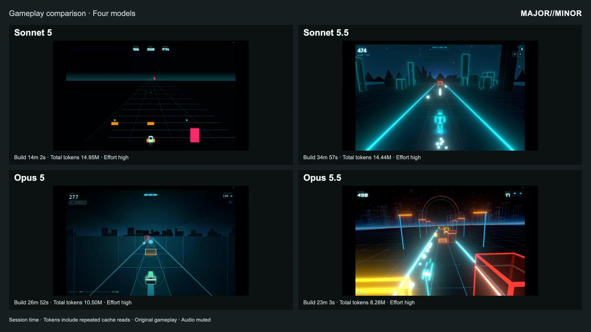

# Four Claude models, one runner prompt

A **controlled one-shot artifact comparison**: one game-building run each for Sonnet 5, Sonnet 5.5, Opus 5 and Opus 5.5. This is **not a statistical model-performance benchmark**. There is no overall quality score.

[](https://github.com/MAJORminorStudio/claude-tron-runner-comparison/releases/download/v1.0.0/comparison-web.mp4)

[Watch/download the 90-second comparison](https://github.com/MAJORminorStudio/claude-tron-runner-comparison/releases/download/v1.0.0/comparison-web.mp4) · [MAJOR//MINOR research article](https://majorminor.xyz/blog/claude-tron-runner-comparison) · [JSON](benchmark/benchmark-summary.json) · [CSV](benchmark/benchmark-summary.csv)

The video shows the first 90 continuous seconds of four supplied desktop recordings, simultaneously at 30 fps with audio muted. The source recordings are 1920 × 1080 / 60 fps. Starts are not aligned to identical game states. Input policy, seeds and graphics settings were not recorded; scores and survival cannot rank the games.

## Exact original prompt

```text
Build an endless runner in Tron visual style.
3 lanes, jump/slide/dodge, obstacles, rewards, etc.
Web browser based game. No Login. No leaderboard.
Keep track of token usage and total time spent building the game.
Do not stop until it passes all tests and is ready to release.
```

The prompt was intentionally left thin: it set the genre, core controls and delivery constraints, then left each model to decide how to turn them into a playable game. Rendering, presentation, difficulty, reward systems and validation strategy were deliberately unspecified. This comparison examines the decisions each model made from that sparse brief; optional additions are observable choices, not retroactive requirements.

The five lines above are verbatim human prompt content shared by all four. Per-session raw payloads retain the original paste wrappers under [evidence/prompts](benchmark/evidence/prompts/).

## Results

| Model | Effort | Session time | Request tokens¹ | Production LOC² | Rendering | Audio in source |
|---|---|---:|---:|---:|---|---|
| Sonnet 5 | high | 14m 02s | 14,947,926 | 1,029 | Canvas 2D | Absent |
| Sonnet 5.5 | high | 34m 57s | 14,440,237 | 3,500 | Three.js / WebGL | Procedural |
| Opus 5 | high | 26m 52s | 10,499,151 | 3,591 | Canvas 2D | Procedural |
| Opus 5.5 | high | 23m 03s | 8,280,038 | 2,779 | Three.js / WebGL | Procedural |

¹ Aggregate observed request counters include repeated cache reads; they are neither unique generated tokens nor invoice-complete costs. ² Physical production lines include comments/blanks; tests, configuration and build output are excluded.

Session time runs from the first user prompt to the final assistant response, including setup/tools/validation. It is not model compute time or an independently verified release-ready instant. Exact UTC endpoints, model IDs, effort fields, cache writes/reads and raw per-message counters are in JSON and [session extracts](benchmark/evidence/).

| Model | Build / delivery | Lint | Typecheck | Unit suite | Native browser suite | Common smoke | Storage denied |
|---|---|---|---|---|---|---|---|
| Sonnet 5 | Static ES modules; no build step | unavailable | unavailable | 15 passed | unavailable | passed | failed |
| Sonnet 5.5 | passed | unavailable | passed | 83 passed | 24 passed | passed | passed |
| Opus 5 | passed | unavailable | passed | 96 passed | unavailable | passed | passed |
| Opus 5.5 | passed | passed | unavailable | 29 passed | 21 passed / 1 intentional skip | passed | passed |

Test counts describe different authored suites and are **not comparable quality scores**. Missing checks are `unavailable`, not passes. Original failures are preserved: Sonnet 5 fails the common denied-storage bootstrap check. Initial browser attempts include a Sonnet 5.5 suite timeout and two invalid Opus 5.5 harness attempts; final native results are shown above. [Logs and screenshots](benchmark/validation/) retain those distinctions. Software-WebGL warnings in Sonnet 5.5 do not establish a native-GPU performance ranking.

## Reproduce the implementations

Use Node 20.19.4 or newer, npm and the checked-in lockfiles. Keep separate servers/ports.

```sh
# Dependency-free static implementation
npm --prefix sonnet5-runner test
npm --prefix sonnet5-runner run serve

# For each bundled implementation: sonnet55-runner, opus5-runner, opus55-runner
npm --prefix sonnet55-runner ci --no-audit --no-fund
npm --prefix sonnet55-runner test
npm --prefix sonnet55-runner run build
npm --prefix sonnet55-runner run dev -- --host 127.0.0.1 --port 5175
```

The optional `--browser` run reports a nonzero result when the known Sonnet 5 denied-storage failure reproduces; review the per-check logs.

Declared lint/typecheck/browser commands and all dependencies are retained in each game's package manifest. To run equivalent validation on disposable copies and preserve published evidence:

```sh
python3 benchmark/scripts/verify-release.py
python3 benchmark/scripts/reproduce.py
# Optional common smoke (installed Chrome):
npm --prefix benchmark/video/remotion ci
python3 benchmark/scripts/reproduce.py --browser
# Optional authored browser suites, with isolated servers:
python3 benchmark/scripts/reproduce.py --native
```

Download the four `https://github.com/MAJORminorStudio/claude-tron-runner-comparison/releases/download/v1.0.0/<model-id>.mp4` assets into `benchmark/video/gameplay/`, with IDs `sonnet-5`, `sonnet-5.5`, `opus-5`, `opus-5.5`. The package archive already includes these silent remuxes.

```sh
npm --prefix benchmark/video/remotion ci
npm --prefix benchmark/video/remotion run verify
npm --prefix benchmark/video/remotion run render -- --kind Grid --format 16x9
```

Offsets/durations are controlled by [video/manifest.json](benchmark/video/manifest.json). The renderer also supports two-model matchups and 4:3, 1:1 and 9:16 outputs.

## Evidence and boundaries

[Methodology](benchmark/methodology.md) · [Limitations](benchmark/limitations.md) · [Validation](benchmark/validation/) · [Source inventory](benchmark/release-manifest.json) · [Implementation reports](benchmark/repo-analysis/) · [License status](LICENSING.md)

Original game source, authored tests, lockfiles and build-stat claims are preserved byte for byte; source hashes verify the public projection. Cache/build output, machine launch configuration, local identities and binary browser traces are excluded; sanitized text failure contexts are retained. Original claims remain historical self-reports; their context-window figures differ from the request usage totals here. Three games implement procedural audio; the public video assets are intentionally silent. Manual review fields remain empty. Same prompt/high effort does not establish identical system context, tool access, hardware load or statistical repeatability.
